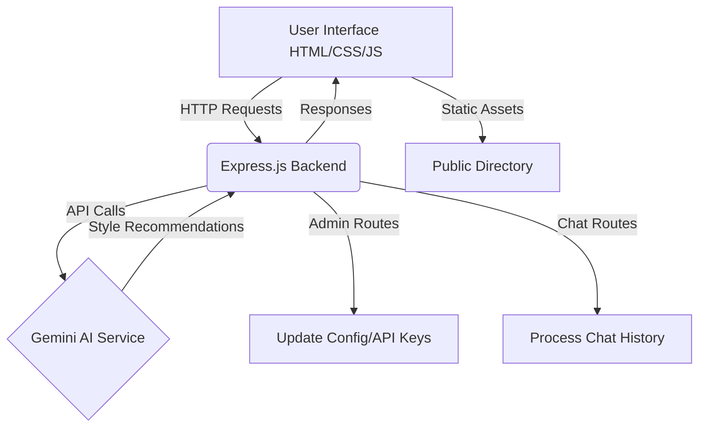

# StyleBot - AI Personal Shopper 🛍️✨

StyleBot is an intelligent, AI-powered personal shopper platform designed to provide dynamic fashion recommendations, seamless multi-role marketplace functionalities, and an interactive chat experience using the Gemini API.

## 🚀 Features

- **AI-Powered Style Assistant**: Get real-time fashion advice, outfit recommendations, and style tips using advanced Gemini AI.
- **Multi-Role Marketplace**:
  - **User**: Chat with the AI, browse the shop, manage profile, and view recommendations.
  - **Seller**: Manage products, add new items, and view inventory.
  - **Admin**: Configure system settings, update API keys dynamically, and oversee the platform.
- **Responsive UI/UX**: A dark, neon-themed, modern interface built with HTML, CSS, and Vanilla JavaScript.
- **Dynamic API Management**: Update Gemini API credentials securely via the Admin dashboard.

## 🏗️ Project Architecture & Flow



## 🛠️ Technology Stack

- **Frontend**: HTML5, CSS3, Vanilla JavaScript
- **Backend**: Node.js, Express.js
- **AI Integration**: Google Gemini API
- **Deployment**: Vercel ready (`vercel.json` included)

## 📁 Directory Structure

```text
├── .env                  # Environment variables (API Keys, PORT)
├── server.js             # Express application entry point
├── geminiService.js      # Gemini API integration and chat logic
├── package.json          # Node.js dependencies and scripts
└── public/               # Static frontend assets
    ├── index.html        # Landing page
    ├── chat.html         # AI Chat interface
    ├── shop.html         # Marketplace store
    ├── profile.html      # User profile management
    ├── seller.html       # Seller product management dashboard
    ├── admin.html        # Admin configuration panel
    ├── style.css         # Global stylesheet
    └── app.js            # Frontend JavaScript logic
```

## ⚙️ Installation & Setup

1. **Clone the repository**:
   ```bash
   git clone https://github.com/Amrittr/AI_style_bot_2.git
   cd AI_style_bot_2
   ```

2. **Install dependencies**:
   ```bash
   npm install
   ```

3. **Configure Environment Variables**:
   Create a `.env` file in the root directory and add your Gemini API Key:
   ```env
   GEMINI_API_KEY=your_gemini_api_key_here
   PORT=3000
   ```
   *(Note: You can also update the API key directly via the Admin Dashboard)*

4. **Start the application**:
   ```bash
   npm start
   ```
   The application will be running on `http://localhost:3000`.

## 🤝 Contributing
Contributions, issues, and feature requests are welcome!

## 📧 Contact
For any queries, please reach out to: [amrittr08@gmail.com](mailto:amrittr08@gmail.com)
